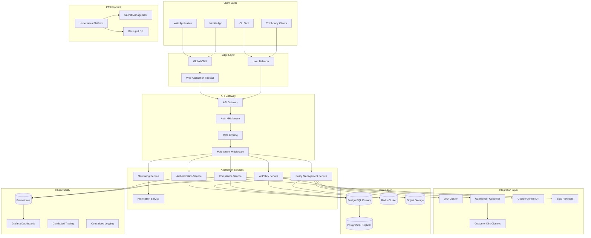
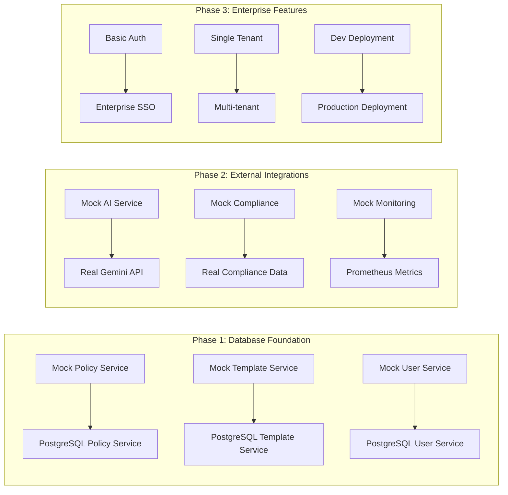
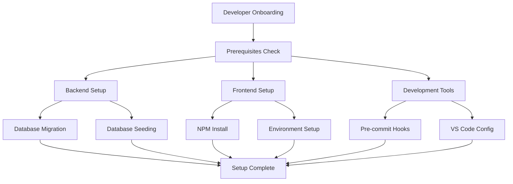
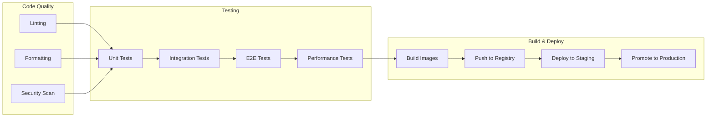

# Design Document

## Overview

This design document outlines the technical architecture and implementation strategy to transform Niyama from a development prototype into a production-ready Policy as Code platform suitable for real company pilots. The design addresses the current workspace analysis findings and focuses on enterprise scalability, real data integration, comprehensive roadmap execution, and optimal workspace organization.

**Current Architecture Assessment:**
- Go backend with Gin framework (solid foundation)
- React frontend with TypeScript (modern stack)
- Basic PostgreSQL integration (needs enhancement)
- Mock data services (requires real data migration)
- Limited authentication (needs enterprise SSO)
- Basic CI/CD pipeline (needs production hardening)

**Target Architecture Goals:**
- Enterprise-grade multi-tenant platform
- Real-time policy evaluation with OPA/Gatekeeper
- AI-powered policy generation with production Gemini integration
- Comprehensive compliance automation
- Scalable microservices architecture
- Production-ready observability and security

## Architecture

### Production-Ready Architecture



### Real Data Migration Strategy

Based on the current workspace analysis, the following mock services need to be replaced with real implementations:

#### Current Mock Services to Replace
1. **Policy Service**: Currently returns hardcoded policy data
2. **Template Service**: Uses static template definitions
3. **Compliance Service**: Returns mock compliance framework data
4. **AI Service**: Uses placeholder responses instead of real Gemini API
5. **User Service**: Basic user management without enterprise features
6. **Monitoring Service**: Mock metrics and alerts

#### Migration Approach


### Enhanced Microservices Architecture

The system will be decomposed into focused microservices for enterprise scalability:

1. **API Gateway Service**: Request routing, authentication, rate limiting, multi-tenancy
2. **Policy Management Service**: CRUD operations, versioning, deployment automation
3. **AI Policy Service**: Production Gemini integration, caching, optimization
4. **Compliance Service**: Real framework data, automated mapping, report generation
5. **Monitoring Service**: Real-time metrics, alerting, performance analytics
6. **User Management Service**: Enterprise SSO, RBAC, organization management
7. **Notification Service**: Multi-channel alerts, escalation, acknowledgment
8. **Integration Service**: OPA/Gatekeeper deployment, Kubernetes cluster management

## Components and Interfaces

### 1. Database Schema Design

#### Core Tables

```sql
-- Organizations (Multi-tenancy)
CREATE TABLE organizations (
    id SERIAL PRIMARY KEY,
    name VARCHAR(255) NOT NULL,
    slug VARCHAR(100) UNIQUE NOT NULL,
    settings JSONB DEFAULT '{}',
    subscription_tier VARCHAR(50) DEFAULT 'starter',
    created_at TIMESTAMP DEFAULT NOW(),
    updated_at TIMESTAMP DEFAULT NOW()
);

-- Users with enhanced enterprise features
CREATE TABLE users (
    id SERIAL PRIMARY KEY,
    email VARCHAR(255) UNIQUE NOT NULL,
    name VARCHAR(255) NOT NULL,
    avatar_url VARCHAR(500),
    sso_provider VARCHAR(50),
    sso_id VARCHAR(255),
    last_login TIMESTAMP,
    is_active BOOLEAN DEFAULT true,
    created_at TIMESTAMP DEFAULT NOW(),
    updated_at TIMESTAMP DEFAULT NOW()
);

-- Enhanced policy table with versioning
CREATE TABLE policies (
    id SERIAL PRIMARY KEY,
    name VARCHAR(255) NOT NULL,
    description TEXT,
    content TEXT NOT NULL,
    language VARCHAR(50) DEFAULT 'rego',
    category VARCHAR(100),
    tags TEXT[],
    status VARCHAR(50) DEFAULT 'draft',
    version INTEGER DEFAULT 1,
    parent_policy_id INTEGER REFERENCES policies(id),
    organization_id INTEGER REFERENCES organizations(id),
    author_id INTEGER REFERENCES users(id),
    metadata JSONB DEFAULT '{}',
    created_at TIMESTAMP DEFAULT NOW(),
    updated_at TIMESTAMP DEFAULT NOW()
);

-- Real compliance frameworks with detailed controls
CREATE TABLE compliance_frameworks (
    id SERIAL PRIMARY KEY,
    name VARCHAR(255) NOT NULL,
    version VARCHAR(50),
    type VARCHAR(100), -- SOC2, HIPAA, GDPR, etc.
    description TEXT,
    authority VARCHAR(255),
    effective_date DATE,
    is_active BOOLEAN DEFAULT true,
    created_at TIMESTAMP DEFAULT NOW()
);

CREATE TABLE compliance_controls (
    id SERIAL PRIMARY KEY,
    framework_id INTEGER REFERENCES compliance_frameworks(id),
    control_id VARCHAR(100) NOT NULL,
    title VARCHAR(500) NOT NULL,
    description TEXT,
    category VARCHAR(100),
    subcategory VARCHAR(100),
    priority VARCHAR(50),
    implementation_guidance TEXT,
    evidence_requirements TEXT[],
    created_at TIMESTAMP DEFAULT NOW()
);

-- Policy evaluations with performance metrics
CREATE TABLE policy_evaluations (
    id SERIAL PRIMARY KEY,
    policy_id INTEGER REFERENCES policies(id),
    input_data JSONB,
    output_data JSONB,
    decision VARCHAR(50),
    execution_time_ms INTEGER,
    memory_usage_kb INTEGER,
    user_id INTEGER REFERENCES users(id),
    organization_id INTEGER REFERENCES organizations(id),
    created_at TIMESTAMP DEFAULT NOW()
);

-- Real-time alerts and notifications
CREATE TABLE alerts (
    id SERIAL PRIMARY KEY,
    type VARCHAR(100) NOT NULL, -- violation, performance, security
    severity VARCHAR(50) NOT NULL, -- low, medium, high, critical
    title VARCHAR(255) NOT NULL,
    description TEXT,
    source_type VARCHAR(100), -- policy, system, integration
    source_id VARCHAR(255),
    organization_id INTEGER REFERENCES organizations(id),
    status VARCHAR(50) DEFAULT 'active', -- active, acknowledged, resolved
    metadata JSONB DEFAULT '{}',
    created_at TIMESTAMP DEFAULT NOW(),
    resolved_at TIMESTAMP
);
```

### 2. API Service Architecture

#### Enhanced REST API Design

```go
// Enhanced API structure with Clerk integration
type APIServer struct {
    Router          *gin.Engine
    DB              *database.Database
    Redis           *redis.Client
    PolicyService   *services.PolicyService
    AIService       *services.AIService
    ComplianceService *services.ComplianceService
    MonitoringService *services.MonitoringService
    NotificationService *services.NotificationService
    ClerkService    *services.ClerkService
    Config          *config.Config
    Metrics         *prometheus.Registry
}

// Clerk authentication middleware
func (s *APIServer) ClerkAuthMiddleware() gin.HandlerFunc {
    return func(c *gin.Context) {
        // Validate Clerk session token from Authorization header
        // Extract user information from Clerk session
        // Sync user data with internal database if needed
        // Set user context for downstream handlers
        // RBAC enforcement based on user roles
        // Rate limiting per user/org
    }
}

// Multi-tenant data isolation
func (s *APIServer) TenantMiddleware() gin.HandlerFunc {
    return func(c *gin.Context) {
        // Extract organization context
        // Enforce data isolation
        // Apply organization-specific settings
    }
}
```

#### Key API Endpoints

```go
// Policy Management with versioning
POST   /api/v1/policies                    // Create policy
GET    /api/v1/policies                    // List policies with filtering
GET    /api/v1/policies/{id}               // Get policy
PUT    /api/v1/policies/{id}               // Update policy
DELETE /api/v1/policies/{id}               // Delete policy
POST   /api/v1/policies/{id}/versions      // Create new version
GET    /api/v1/policies/{id}/versions      // List versions
POST   /api/v1/policies/{id}/test          // Test policy
POST   /api/v1/policies/{id}/deploy        // Deploy to clusters

// AI-Enhanced Policy Generation
POST   /api/v1/ai/generate-policy          // Generate policy from description
POST   /api/v1/ai/optimize-policy          // Optimize existing policy
POST   /api/v1/ai/analyze-compliance       // Analyze compliance gaps
POST   /api/v1/ai/recommendations          // Get intelligent recommendations

// Real Compliance Management
GET    /api/v1/compliance/frameworks       // List frameworks
GET    /api/v1/compliance/controls/{framework} // Get controls
POST   /api/v1/compliance/mapping          // Map policies to controls
GET    /api/v1/compliance/reports/{framework} // Generate reports
POST   /api/v1/compliance/audit-trail      // Export audit data

// Enterprise Monitoring
GET    /api/v1/monitoring/metrics          // Real-time metrics
GET    /api/v1/monitoring/alerts           // Active alerts
POST   /api/v1/monitoring/alerts/{id}/acknowledge // Acknowledge alert
GET    /api/v1/monitoring/performance      // Performance analytics
GET    /api/v1/monitoring/health           // System health check

// Organization Management
GET    /api/v1/organizations               // List organizations
POST   /api/v1/organizations               // Create organization
GET    /api/v1/organizations/{id}/users    // List org users
POST   /api/v1/organizations/{id}/invite   // Invite users
PUT    /api/v1/organizations/{id}/settings // Update settings
```

### 3. Real Data Integration Layer

#### OPA Integration Service

```go
type OPAIntegration struct {
    Client      *http.Client
    BundleStore string
    Endpoints   []string
    Config      *OPAConfig
}

func (o *OPAIntegration) DeployPolicy(policy *models.Policy) error {
    // Convert policy to OPA bundle format
    // Deploy to OPA instances
    // Verify deployment success
    // Update policy status
}

func (o *OPAIntegration) EvaluatePolicy(policyID string, input interface{}) (*PolicyResult, error) {
    // Send evaluation request to OPA
    // Collect performance metrics
    // Log evaluation for audit
    // Return structured result
}
```

#### Gatekeeper Integration Service

```go
type GatekeeperIntegration struct {
    KubeClient kubernetes.Interface
    Config     *GatekeeperConfig
}

func (g *GatekeeperIntegration) CreateConstraintTemplate(policy *models.Policy) error {
    // Generate Gatekeeper ConstraintTemplate
    // Apply to Kubernetes cluster
    // Monitor deployment status
}

func (g *GatekeeperIntegration) CreateConstraint(template string, config ConstraintConfig) error {
    // Create Constraint instance
    // Apply enforcement configuration
    // Set up violation monitoring
}
```

#### Prometheus Metrics Integration

```go
type MetricsCollector struct {
    PrometheusClient prometheus_api.Client
    Metrics         map[string]prometheus.Collector
}

func (m *MetricsCollector) CollectPolicyMetrics() (*PolicyMetrics, error) {
    // Query Prometheus for policy evaluation metrics
    // Aggregate performance data
    // Calculate compliance scores
    // Generate trend analysis
}
```

### 4. AI Service Enhancement

#### Production Gemini Integration

```go
type EnhancedAIService struct {
    GeminiClient    *genai.Client
    Cache          *redis.Client
    RateLimiter    *rate.Limiter
    MetricsCollector *MetricsCollector
}

func (ai *EnhancedAIService) GeneratePolicy(req PolicyGenerationRequest) (*PolicyResponse, error) {
    // Validate input and apply rate limiting
    // Check cache for similar requests
    // Generate policy using Gemini with context
    // Validate generated policy syntax
    // Cache result with appropriate TTL
    // Collect usage metrics
}

func (ai *EnhancedAIService) AnalyzeCompliance(policy string, frameworks []string) (*ComplianceAnalysis, error) {
    // Analyze policy against compliance frameworks
    // Identify gaps and recommendations
    // Generate mapping suggestions
    // Provide implementation guidance
}
```

## Data Models

### Enhanced Policy Model

```go
type Policy struct {
    ID              uint                   `json:"id" gorm:"primaryKey"`
    Name            string                 `json:"name" gorm:"not null"`
    Description     string                 `json:"description"`
    Content         string                 `json:"content" gorm:"type:text"`
    Language        string                 `json:"language" gorm:"default:rego"`
    Category        string                 `json:"category"`
    Tags            []string               `json:"tags" gorm:"serializer:json"`
    Status          PolicyStatus           `json:"status" gorm:"default:draft"`
    Version         int                    `json:"version" gorm:"default:1"`
    ParentPolicyID  *uint                  `json:"parent_policy_id"`
    ParentPolicy    *Policy                `json:"parent_policy,omitempty"`
    OrganizationID  uint                   `json:"organization_id"`
    Organization    Organization           `json:"organization"`
    AuthorID        uint                   `json:"author_id"`
    Author          User                   `json:"author"`
    Metadata        map[string]interface{} `json:"metadata" gorm:"serializer:json"`
    
    // Performance tracking
    EvaluationCount int64                  `json:"evaluation_count" gorm:"default:0"`
    ViolationCount  int64                  `json:"violation_count" gorm:"default:0"`
    AvgExecutionTime float64              `json:"avg_execution_time" gorm:"default:0"`
    
    // Compliance mapping
    ComplianceMappings []PolicyComplianceMapping `json:"compliance_mappings"`
    
    // Deployment tracking
    DeploymentStatus   DeploymentStatus   `json:"deployment_status" gorm:"default:not_deployed"`
    DeployedClusters   []string          `json:"deployed_clusters" gorm:"serializer:json"`
    LastDeployedAt     *time.Time        `json:"last_deployed_at"`
    
    CreatedAt       time.Time              `json:"created_at"`
    UpdatedAt       time.Time              `json:"updated_at"`
    DeletedAt       gorm.DeletedAt         `json:"-" gorm:"index"`
}

type DeploymentStatus string

const (
    DeploymentNotDeployed DeploymentStatus = "not_deployed"
    DeploymentPending     DeploymentStatus = "pending"
    DeploymentDeployed    DeploymentStatus = "deployed"
    DeploymentFailed      DeploymentStatus = "failed"
)
```

### Real Compliance Framework Model

```go
type ComplianceFramework struct {
    ID              uint                    `json:"id" gorm:"primaryKey"`
    Name            string                  `json:"name" gorm:"not null"`
    Version         string                  `json:"version"`
    Type            string                  `json:"type"` // SOC2, HIPAA, GDPR, etc.
    Description     string                  `json:"description"`
    Authority       string                  `json:"authority"` // AICPA, HHS, EU, etc.
    EffectiveDate   *time.Time             `json:"effective_date"`
    IsActive        bool                   `json:"is_active" gorm:"default:true"`
    
    // Framework metadata
    Scope           []string               `json:"scope" gorm:"serializer:json"`
    Applicability   map[string]interface{} `json:"applicability" gorm:"serializer:json"`
    
    // Controls relationship
    Controls        []ComplianceControl    `json:"controls"`
    
    CreatedAt       time.Time              `json:"created_at"`
    UpdatedAt       time.Time              `json:"updated_at"`
}

type ComplianceControl struct {
    ID                      uint                    `json:"id" gorm:"primaryKey"`
    FrameworkID            uint                    `json:"framework_id"`
    Framework              ComplianceFramework     `json:"framework"`
    ControlID              string                  `json:"control_id" gorm:"not null"`
    Title                  string                  `json:"title" gorm:"not null"`
    Description            string                  `json:"description"`
    Category               string                  `json:"category"`
    Subcategory            string                  `json:"subcategory"`
    Priority               string                  `json:"priority"`
    
    // Implementation details
    ImplementationGuidance string                  `json:"implementation_guidance"`
    EvidenceRequirements   []string               `json:"evidence_requirements" gorm:"serializer:json"`
    TestingProcedures      []string               `json:"testing_procedures" gorm:"serializer:json"`
    
    // Policy mappings
    PolicyMappings         []PolicyComplianceMapping `json:"policy_mappings"`
    
    CreatedAt              time.Time               `json:"created_at"`
    UpdatedAt              time.Time               `json:"updated_at"`
}
```

## Error Handling

### Comprehensive Error Management

```go
type APIError struct {
    Code        string                 `json:"code"`
    Message     string                 `json:"message"`
    Details     map[string]interface{} `json:"details,omitempty"`
    Timestamp   time.Time              `json:"timestamp"`
    RequestID   string                 `json:"request_id"`
    UserID      *uint                  `json:"user_id,omitempty"`
    OrgID       *uint                  `json:"org_id,omitempty"`
}

// Error categories
const (
    ErrCodeValidation     = "VALIDATION_ERROR"
    ErrCodeAuthentication = "AUTHENTICATION_ERROR"
    ErrCodeAuthorization  = "AUTHORIZATION_ERROR"
    ErrCodeNotFound       = "NOT_FOUND"
    ErrCodeConflict       = "CONFLICT"
    ErrCodeRateLimit      = "RATE_LIMIT_EXCEEDED"
    ErrCodeInternal       = "INTERNAL_ERROR"
    ErrCodeExternalAPI    = "EXTERNAL_API_ERROR"
    ErrCodeDeployment     = "DEPLOYMENT_ERROR"
)

// Error handling middleware
func ErrorHandlingMiddleware() gin.HandlerFunc {
    return func(c *gin.Context) {
        c.Next()
        
        if len(c.Errors) > 0 {
            err := c.Errors.Last()
            
            // Log error with context
            logger.Error("API Error",
                "error", err.Error(),
                "path", c.Request.URL.Path,
                "method", c.Request.Method,
                "user_id", c.GetUint("user_id"),
                "org_id", c.GetUint("org_id"),
                "request_id", c.GetString("request_id"),
            )
            
            // Return structured error response
            apiErr := &APIError{
                Code:      determineErrorCode(err),
                Message:   err.Error(),
                Timestamp: time.Now(),
                RequestID: c.GetString("request_id"),
            }
            
            c.JSON(getHTTPStatus(apiErr.Code), apiErr)
        }
    }
}
```

## Testing Strategy

### Comprehensive Testing Approach

#### 1. Unit Testing
- **Backend**: 90%+ coverage for all services and models
- **Frontend**: Component testing with React Testing Library
- **AI Service**: Mock Gemini API responses for consistent testing

#### 2. Integration Testing
- **Database**: Test real PostgreSQL interactions with test containers
- **OPA Integration**: Test policy deployment and evaluation
- **Gatekeeper**: Test Kubernetes constraint creation and enforcement
- **API**: End-to-end API testing with real database

#### 3. Performance Testing
- **Load Testing**: k6 scripts for API endpoints under load
- **Policy Evaluation**: Benchmark OPA performance with large policy sets
- **Database**: Query performance testing with realistic data volumes
- **Caching**: Redis performance and cache hit rate testing

#### 4. Security Testing
- **Authentication**: Test JWT token validation and SSO integration
- **Authorization**: RBAC enforcement testing
- **Input Validation**: SQL injection and XSS prevention
- **API Security**: Rate limiting and abuse prevention

#### 5. Compliance Testing
- **Data Privacy**: GDPR compliance testing
- **Audit Trails**: Comprehensive logging verification
- **Access Controls**: SOC2 control testing
- **Encryption**: Data protection verification

### Test Data Management

```go
// Test data factory for realistic testing
type TestDataFactory struct {
    DB *gorm.DB
}

func (f *TestDataFactory) CreateTestOrganization() *models.Organization {
    return &models.Organization{
        Name: "Test Corp",
        Slug: "test-corp",
        Settings: map[string]interface{}{
            "compliance_frameworks": []string{"SOC2", "HIPAA"},
            "policy_approval_required": true,
        },
    }
}

func (f *TestDataFactory) CreateRealComplianceFramework() *models.ComplianceFramework {
    // Create SOC2 framework with real controls
    return &models.ComplianceFramework{
        Name:        "SOC 2 Type II",
        Version:     "2017",
        Type:        "SOC2",
        Authority:   "AICPA",
        Description: "System and Organization Controls 2",
        Controls:    f.createSOC2Controls(),
    }
}

func (f *TestDataFactory) createSOC2Controls() []models.ComplianceControl {
    return []models.ComplianceControl{
        {
            ControlID:   "CC6.1",
            Title:       "Logical and Physical Access Controls",
            Description: "The entity implements logical and physical access controls to protect against threats from sources outside its system boundaries.",
            Category:    "Common Criteria",
            Priority:    "High",
            ImplementationGuidance: "Implement network firewalls, access control lists, and physical security measures.",
            EvidenceRequirements: []string{
                "Network security configuration",
                "Access control policies",
                "Physical security procedures",
            },
        },
        // Additional real SOC2 controls...
    }
}
```

## Workspace Organization Design

### Current Workspace Analysis
Based on the existing structure, several improvements are needed:

```
Current Issues:
├── node_modules/ (should be in frontend/)
├── Mixed config files at root level
├── Limited development automation
├── Basic CI/CD pipeline
└── Incomplete documentation structure
```

### Optimized Workspace Structure
```
niyama/
├── .github/                    # GitHub workflows and templates
├── .kiro/                      # Kiro configuration and specs
├── backend/                    # Go backend (renamed from backend-go)
│   ├── cmd/                    # Application entry points
│   ├── internal/               # Private application code
│   ├── pkg/                    # Public library code
│   ├── migrations/             # Database migrations
│   └── tests/                  # Backend-specific tests
├── frontend/                   # React application
│   ├── src/                    # Source code
│   ├── tests/                  # Frontend tests
│   └── node_modules/           # Dependencies (moved here)
├── infrastructure/             # Infrastructure as Code
│   ├── kubernetes/             # K8s manifests
│   ├── terraform/              # Terraform configurations
│   ├── helm/                   # Helm charts
│   └── monitoring/             # Observability configs
├── tests/                      # Cross-system tests
├── docs/                       # Comprehensive documentation
├── scripts/                    # Automation scripts
├── config/                     # Environment configurations
└── tools/                      # Development utilities
```

### Development Automation Design

#### Automated Setup Process


#### Enhanced CI/CD Pipeline Design


## Implementation Roadmap

### Phase 1: Foundation & Real Data (Q1 2025)
**Goal**: Replace mock services with production-ready implementations

#### Month 1: Database & Infrastructure
- **Week 1-2**: PostgreSQL schema design and migration system
- **Week 3-4**: Redis caching layer and session management
- **Deliverables**: Production database, caching infrastructure

#### Month 2: Real Data Migration
- **Week 1-2**: Replace mock policy and template services
- **Week 3-4**: Implement real compliance framework data
- **Deliverables**: All mock services replaced with real implementations

#### Month 3: Authentication & Multi-tenancy
- **Week 1-2**: Clerk Pro integration with enterprise SSO
- **Week 3-4**: Multi-tenant data isolation and RBAC
- **Deliverables**: Enterprise-ready authentication system

### Phase 2: Enterprise Features (Q2 2025)
**Goal**: Add enterprise-grade capabilities for pilot deployment

#### Month 4: AI Integration & Security
- **Week 1-2**: Production Gemini API integration with caching
- **Week 3-4**: Security hardening and compliance certification
- **Deliverables**: AI-powered features, SOC2 compliance

#### Month 5: Monitoring & Observability
- **Week 1-2**: Prometheus/Grafana monitoring stack
- **Week 3-4**: Real-time alerting and notification system
- **Deliverables**: Comprehensive observability platform

#### Month 6: Policy Engine Integration
- **Week 1-2**: OPA cluster integration and management
- **Week 3-4**: Gatekeeper deployment automation
- **Deliverables**: Production policy evaluation engine

### Phase 3: Scale & Advanced Features (Q3-Q4 2025)
**Goal**: Enterprise scale and competitive differentiation

#### Months 7-9: Advanced Capabilities
- Cloud provider integrations (AWS, Azure, GCP)
- Advanced analytics and ML insights
- Policy marketplace and ecosystem
- **Deliverables**: Market-leading feature set

#### Months 10-12: Global Scale
- Multi-region deployment architecture
- Advanced performance optimization
- Global compliance variations
- **Deliverables**: Globally scalable platform

### Phase 4: Market Leadership (Q1-Q2 2026)
**Goal**: Industry leadership and innovation

#### Months 13-15: AI Innovation
- Predictive policy analytics
- Automated compliance workflows
- Natural language policy creation
- **Deliverables**: Next-generation AI capabilities

#### Months 16-18: Ecosystem Expansion
- Partner integrations and certifications
- Industry-specific solutions
- Professional services platform
- **Deliverables**: Complete ecosystem platform