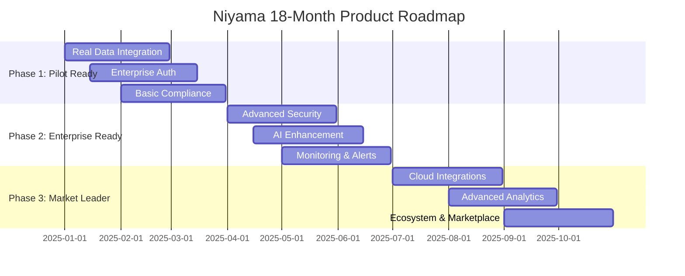

# Niyama Product Roadmap (18 Months)

## Executive Summary

This roadmap transforms Niyama from a development prototype into a market-leading Policy as Code platform through three strategic phases: **Pilot Ready** (Q1-Q2), **Enterprise Ready** (Q3-Q4), and **Market Leader** (Q5-Q6).

## Roadmap Overview

## Phase 1: Pilot Ready (Q1-Q2 2025)
**Goal**: Production deployment for 50-500 employee companies

### Q1 2025: Foundation & Real Data
**Theme**: "From Mock to Real"

#### 1.1 Real Data Integration (Jan-Feb 2025)
- **Business Value**: High (9/10) - Essential for production use
- **Technical Complexity**: Medium (6/10) - Database migration and API updates
- **Resources**: 2 backend developers, 1 DevOps engineer
- **Success Metrics**: 
  - 100% mock data replaced with real database queries
  - <200ms API response times
  - 99.9% database uptime

**Deliverables:**
- Production PostgreSQL schema with migrations
- Real compliance framework data (SOC2, HIPAA, GDPR)
- Performance-optimized database queries
- Redis caching layer implementation

#### 1.2 Enterprise Authentication (Jan-Mar 2025)
- **Business Value**: High (9/10) - Required for enterprise adoption
- **Technical Complexity**: Medium (7/10) - SSO integration complexity
- **Resources**: 1 backend developer, 1 frontend developer
- **Success Metrics**:
  - Support for 3+ SSO providers (SAML, OIDC, Google)
  - <2 second authentication flow
  - 100% audit trail coverage

**Deliverables:**
- Clerk Pro integration with SSO
- Multi-tenant organization management
- RBAC with granular permissions
- Audit logging system

### Q2 2025: Compliance & Security
**Theme**: "Enterprise Grade Security"

#### 2.1 Compliance Framework Integration (Feb-Apr 2025)
- **Business Value**: High (8/10) - Key differentiator
- **Technical Complexity**: Medium (6/10) - Data modeling and mapping
- **Resources**: 1 backend developer, 1 compliance specialist
- **Success Metrics**:
  - 3 major frameworks fully supported
  - Automated compliance scoring
  - Report generation in <30 seconds

**Deliverables:**
- Complete SOC2 Type II controls database
- HIPAA Administrative, Physical, Technical Safeguards
- GDPR Articles 25, 32, 35 implementation
- Automated compliance report generation

#### 2.2 Production Security Hardening (Mar-Apr 2025)
- **Business Value**: High (9/10) - Security table stakes
- **Technical Complexity**: Medium (7/10) - Security implementation
- **Resources**: 1 security engineer, 1 DevOps engineer
- **Success Metrics**:
  - Zero critical security vulnerabilities
  - SOC2 compliance certification
  - <1 second encrypted data access

**Deliverables:**
- TLS 1.3 encryption implementation
- AES-256 data encryption at rest
- Automated security scanning in CI/CD
- Vulnerability management process

## Phase 2: Enterprise Ready (Q3-Q4 2025)
**Goal**: Scalable platform for 500-5000 employee enterprises

### Q3 2025: AI & Intelligence
**Theme**: "Intelligent Policy Management"

#### 3.1 Production AI Integration (Apr-Jun 2025)
- **Business Value**: High (8/10) - Competitive advantage
- **Technical Complexity**: High (8/10) - AI model integration
- **Resources**: 1 AI engineer, 1 backend developer
- **Success Metrics**:
  - 90% policy generation accuracy
  - <5 second AI response times
  - 50% reduction in policy creation time

**Deliverables:**
- Google Gemini Pro API integration
- Intelligent policy generation from natural language
- Policy optimization recommendations
- Compliance gap analysis automation

#### 3.2 Advanced Monitoring & Observability (May-Jul 2025)
- **Business Value**: Medium (7/10) - Operational excellence
- **Technical Complexity**: Medium (6/10) - Monitoring stack setup
- **Resources**: 1 DevOps engineer, 1 backend developer
- **Success Metrics**:
  - 99.9% system uptime
  - <1 minute alert response time
  - 360-degree system visibility

**Deliverables:**
- Prometheus/Grafana monitoring stack
- Real-time alerting system (Slack, email, webhooks)
- Performance analytics dashboard
- Automated incident response

### Q4 2025: Scale & Performance
**Theme**: "Enterprise Scale"

#### 4.1 Horizontal Scaling Architecture (Jul-Sep 2025)
- **Business Value**: High (8/10) - Enterprise requirement
- **Technical Complexity**: High (9/10) - Distributed systems
- **Resources**: 2 backend developers, 1 DevOps engineer
- **Success Metrics**:
  - 10,000+ concurrent users support
  - Auto-scaling based on load
  - <100ms policy evaluation times

**Deliverables:**
- Microservices architecture implementation
- Kubernetes auto-scaling policies
- Load balancing and service discovery
- Database read replicas and sharding

#### 4.2 Advanced Policy Engine (Aug-Oct 2025)
- **Business Value**: High (8/10) - Core platform capability
- **Technical Complexity**: High (8/10) - OPA integration complexity
- **Resources**: 2 backend developers, 1 platform engineer
- **Success Metrics**:
  - 10,000+ policy evaluations per second
  - Real-time policy deployment
  - Zero-downtime policy updates

**Deliverables:**
- Production OPA cluster integration
- Gatekeeper constraint automation
- Policy versioning and rollback
- Real-time violation monitoring

## Phase 3: Market Leader (Q5-Q6 2025)
**Goal**: Industry-leading platform with advanced capabilities

### Q5 2025: Cloud & Ecosystem
**Theme**: "Universal Integration"

#### 5.1 Multi-Cloud Integration (Oct-Dec 2025)
- **Business Value**: High (9/10) - Market expansion
- **Technical Complexity**: High (8/10) - Multiple cloud APIs
- **Resources**: 2 platform engineers, 1 cloud architect
- **Success Metrics**:
  - 3 major cloud providers supported
  - Native cloud service integrations
  - Cross-cloud policy deployment

**Deliverables:**
- AWS integration (EKS, IAM, Config)
- Azure integration (AKS, AD, Policy)
- GCP integration (GKE, IAM, Security Command Center)
- Multi-cloud policy orchestration

#### 5.2 Developer Ecosystem (Nov 2025-Jan 2026)
- **Business Value**: Medium (7/10) - Ecosystem growth
- **Technical Complexity**: Medium (6/10) - API and SDK development
- **Resources**: 1 developer advocate, 2 backend developers
- **Success Metrics**:
  - 100+ community-contributed policies
  - 10+ third-party integrations
  - Developer satisfaction >8/10

**Deliverables:**
- Policy marketplace and community
- REST API SDK for major languages
- Webhook and integration framework
- Developer documentation and tutorials

### Q6 2025: Advanced Analytics
**Theme**: "Predictive Intelligence"

#### 6.1 Advanced Analytics & ML (Dec 2025-Feb 2026)
- **Business Value**: High (8/10) - Future differentiation
- **Technical Complexity**: High (9/10) - ML model development
- **Resources**: 1 ML engineer, 1 data scientist, 1 backend developer
- **Success Metrics**:
  - 85% violation prediction accuracy
  - Proactive risk identification
  - 30% reduction in security incidents

**Deliverables:**
- Predictive policy violation analytics
- Risk assessment and scoring algorithms
- Automated remediation suggestions
- Executive business intelligence dashboards

#### 6.2 Global Deployment & Compliance (Jan-Mar 2026)
- **Business Value**: High (8/10) - Global market access
- **Technical Complexity**: High (8/10) - Multi-region complexity
- **Resources**: 1 DevOps engineer, 1 compliance specialist
- **Success Metrics**:
  - 5+ global regions supported
  - Regional compliance variations
  - <50ms global response times

**Deliverables:**
- Multi-region deployment architecture
- Data residency compliance (EU, US, APAC)
- Regional compliance framework variations
- Global CDN and edge computing

## Success Metrics & KPIs

### Business Metrics
- **Customer Acquisition**: 50 pilot customers by Q2, 200 by Q4, 500 by Q6
- **Revenue Growth**: $1M ARR by Q4, $5M ARR by Q6
- **Market Position**: Top 3 Policy as Code platform by Q6
- **Customer Satisfaction**: NPS >50 by Q4, >70 by Q6

### Technical Metrics
- **Performance**: <200ms API response times, 99.9% uptime
- **Scale**: Support 10,000+ concurrent users, 1M+ policies
- **Security**: Zero critical vulnerabilities, SOC2 Type II compliance
- **Quality**: 90%+ test coverage, <1% bug rate

### Product Metrics
- **Feature Adoption**: 80%+ of customers using AI features by Q4
- **Integration Usage**: 60%+ using cloud integrations by Q6
- **Community Growth**: 1000+ community members by Q6
- **Developer Ecosystem**: 100+ third-party integrations by Q6

## Risk Assessment & Mitigation

### High-Risk Items
1. **AI Model Performance**: Risk of poor policy generation quality
   - **Mitigation**: Extensive testing, human-in-the-loop validation
   
2. **Enterprise Security Requirements**: Complex compliance needs
   - **Mitigation**: Early security audits, compliance expertise

3. **Multi-Cloud Complexity**: Integration challenges across providers
   - **Mitigation**: Phased rollout, cloud-specific expertise

### Medium-Risk Items
1. **Scaling Challenges**: Performance under enterprise load
   - **Mitigation**: Load testing, gradual scaling approach

2. **Competitive Pressure**: Fast-moving market landscape
   - **Mitigation**: Rapid iteration, customer feedback loops

## Resource Requirements

### Team Composition (Peak)
- **Engineering**: 8 developers (4 backend, 2 frontend, 1 AI, 1 platform)
- **DevOps**: 2 engineers
- **Product**: 1 product manager
- **Design**: 1 UX/UI designer
- **Compliance**: 1 specialist
- **Developer Relations**: 1 advocate

### Technology Investments
- **Cloud Infrastructure**: $50K/quarter scaling to $200K/quarter
- **AI/ML Services**: $20K/quarter scaling to $100K/quarter
- **Security Tools**: $30K/quarter
- **Monitoring & Analytics**: $15K/quarter

## Competitive Analysis

### Current Market Position
- **Strengths**: AI-powered policy generation, comprehensive compliance
- **Weaknesses**: Limited enterprise features, small market presence
- **Opportunities**: Growing Policy as Code market, compliance automation demand
- **Threats**: Established players (Styra, Fairwinds), cloud provider solutions

### Differentiation Strategy
1. **AI-First Approach**: Leading policy generation and optimization
2. **Compliance Automation**: Comprehensive framework support
3. **Developer Experience**: Superior UX and integration ecosystem
4. **Multi-Cloud Support**: Vendor-neutral platform approach

## Conclusion

This roadmap positions Niyama to capture significant market share in the growing Policy as Code space through strategic focus on enterprise needs, AI differentiation, and comprehensive compliance support. Success depends on execution excellence, customer feedback integration, and maintaining technical innovation leadership.